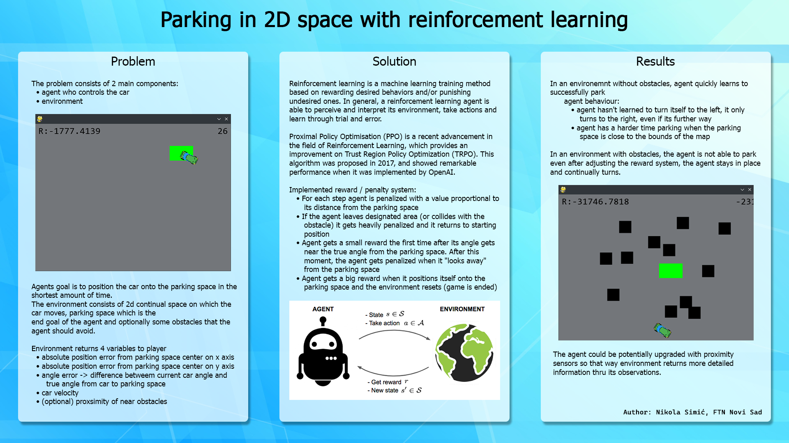

# Parking in 2D space with reinforcement learning



## Installation guide

* Clone repository or download the zip

* Install dependencies from requirements.txt file with 
```bash
    pip install -r requirements.txt
```

* Run game with human controls:
```bash
    python main.py
```

* Train model or let model play:
    ```bash
        python train.py *arguments*
    ```

    * train.py arguments

        * -a | --algorithm | rl algorithm [ppo, a2c] | default: ppo
        * -o | --obstacles | number of obstacles | default : 0
        * -m | --model | load model from file
        * -t | --timestamps | number of timestamps in one run
        * -p | --play | let model play game without training


